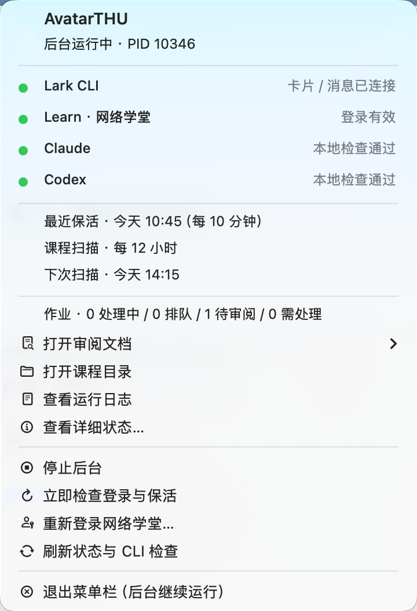

# AvatarTHU

[简体中文](README.md) · **English**

A local assistant that connects Tsinghua Web Learning course materials, assignment work, and your final review.

**Built as a native Go application.** The core is a single executable: no Python, pip, virtual environment, Go, or Java runtime to install. macOS archives also include a native menu bar monitor. The scheduler and optional monitor stay in the background, and the writer and reviewer CLIs start when work is available. Feishu is optional; downloading materials, preparing assignments, and reviewing them locally also work without it.

[Download a release](https://github.com/Sskift/AvatarTHU/releases) · [Report an issue](https://github.com/Sskift/AvatarTHU/issues) · [Attribution and licenses](THIRD_PARTY.md)

[First-time setup](#quickstart) · [Copy a setup prompt for your agent](#agent-setup)

[macOS menu bar monitor](#macos-menubar)

## See it in action

These screenshots use a **fictional assignment and fictional review records**. They are not evidence of a completed assignment or a real model review. The card is a local rendering of the application's generated JSON; the document images capture actual Feishu document content. Only product content is shown: no personal names, avatars, student IDs, accounts, private links, or real course materials. See the [screenshot notes](docs/images/README.md).

The current card, document, and CLI messages are primarily in Chinese; this English README does not imply an English application interface.

### 1. Decide what happens next from the card

Check the revision and review status, open the full document, or leave revision instructions. You decide whether to submit.


### 2. Compare the assignment with the results

The cloud document separates the original requirements, numbered instructions, and result table so you can compare the requested work with the current output.


### 3. Keep deliverables and review history together

Native attachments can be previewed or downloaded. The document ends with each review round's verdict, specific comments, and remaining limitations.

<details>
<summary>Show complete deliverables</summary>


</details>

<details>
<summary>Show independent review history</summary>


</details>

<a id="quickstart"></a>

## First-time setup: from download to background operation

Follow these six steps on a new machine. **You do not need to clone the repository or install Go or Python.** You need your own Web Learning account and the selected writing and review tools installed and signed in (Claude Code, Codex CLI, or both). Initial school login requires Chrome; Windows also supports Edge. Feishu is optional. You can also use the [agent setup prompt](#agent-setup) below.

### 1. Download the right executable

Open [Releases](https://github.com/Sskift/AvatarTHU/releases), choose the newest available release, and expand Assets. Current releases are Alpha prereleases.

| Computer | Archive |
| --- | --- |
| macOS · Apple silicon | `avatarthu-darwin-arm64.tar.gz` |
| macOS · Intel | `avatarthu-darwin-amd64.tar.gz` |
| Windows · Intel / AMD 64-bit | `avatarthu-windows-amd64.zip` |
| Windows · ARM64 | `avatarthu-windows-arm64.zip` |
| Linux · x86_64 | `avatarthu-linux-amd64.tar.gz` |
| Linux · ARM64 / aarch64 | `avatarthu-linux-arm64.tar.gz` |

Use `uname -m` on macOS / Linux, or check **Settings → System → About** on Windows, to identify your architecture. Download `SHA256SUMS` from the same release. Compare the matching entry with `shasum -a 256 FILENAME` on macOS, `sha256sum FILENAME` on Linux, or `Get-FileHash FILENAME -Algorithm SHA256` in PowerShell, then extract the archive.

### 2. Install the command without starting the service

Keep `AvatarTHU.app` beside `avatarthu` in the extracted macOS archive. Initialization installs this menu bar component too (macOS 12 or later). Users do not need Swift, Xcode, or an additional runtime.

Open a terminal in the extracted directory. On macOS / Linux:

```sh
chmod +x avatarthu
./avatarthu init --no-login --no-start
```

Windows PowerShell:

```powershell
.\avatarthu.exe init --no-login --no-start
```

Initialization installs the executable in your user directory and configures the command entry point. Open a new terminal, then use `avatarthu` directly. If a new Windows terminal has not picked up the updated user PATH, sign out and back in, or use the full path printed by the installer. If macOS blocks the downloaded executable, allow it in **System Settings → Privacy & Security**. The current prerelease is not Apple-notarized or Windows code-signed.

In a new terminal, check:

```sh
avatarthu --version
```

This step only installs and initializes the application. Running `init` without flags also signs in and starts the service, which is useful when your tools and configuration are already ready.

### 3. Prepare the writer and reviewer CLIs

Choose the writer and reviewer harness independently, each from Claude Code or Codex CLI. Only selected tools need to be installed and signed in; selecting the same harness for both roles requires only that CLI. Save the choice first with `avatarthu configure --writer claude --reviewer codex`, adjusting each option as desired. Reuse working installations. Run `avatarthu tools` for installation instructions, or see [Required and optional tools](#required-and-optional-tools). Run each selected CLI to complete authentication, exit their interactive sessions, and check:

```sh
avatarthu tools
avatarthu doctor
```

Each CLI marked as required by the current configuration should report “可启动，登录检查通过” (launch and authentication checks passed). This does not validate live quota or complete an assignment. Writing and review use your own CLI accounts and quota. You can still synchronize materials while a CLI is unavailable; leave step 6 for later.

### 4. Choose roles and sign in to Web Learning

```sh
avatarthu configure --writer claude --reviewer codex --poll-interval 12h --max-review-rounds 3
avatarthu login thu
avatarthu keepalive run
```

This selects Claude as writer and Codex as reviewer. Set `--writer` and `--reviewer` independently to `claude` or `codex`; both roles may use the same harness. Replace `12h` with values such as `30m`, `6h`, or `1d`; keepalive remains every 10 minutes. Each CLI keeps its own default model.

On macOS, `login thu` first tries the existing Web Learning session in Chrome. Otherwise, it opens a dedicated AvatarTHU browser window for you to complete SSO and any two-factor authentication. Windows supports Chrome and Edge. Selenium, ChromeDriver, and a separate AutoThu executable are not required.

The `state` returned by `keepalive run` should be `valid`, confirming that the school session works.

### 5. Choose optional Feishu integration and synchronize once

**Local use only:** Feishu is disabled on a fresh installation. Proceed directly to synchronization. To disable it in an existing configuration, run `avatarthu notifications off`.

**Feishu cards and cloud documents:** Run the following command and follow the application setup and account authorization flow. If Lark CLI is missing, the application can install it using a local npm installation. You can also start with local mode if Node.js/npm is not available.

```sh
avatarthu login lark --no-start
```

The `--no-start` flag lets you finish configuration first; omitting it starts the service immediately. Then synchronize:

```sh
avatarthu run --sync-only
avatarthu status
```

Expect “同步完成” (synchronization complete), course materials under `~/.avatarthu/courses/`, and discovered assignments with status `queued`. An empty list is normal if there are no pending assignments. This step downloads materials and **does not start writing or review**. When Feishu is enabled, it also delivers unread announcements and marks them read after saving successful delivery receipts.

### 6. Start the background service and find your first output

```sh
avatarthu service start
avatarthu status
avatarthu keepalive status
```

The service starts processing discovered assignments **without waiting 12 hours**; that interval controls subsequent course scans. On first use, all eligible pending assignments discovered by the scan are processed. To try just one first, leave the service stopped and use `avatarthu run --task TASK_ID` in the foreground. Find the task ID with `status`.

Check `status` again after startup: the scheduler should be `running` and the school session `valid`. With Feishu enabled, the `actions` and `messages` connections should become `ready`. A review-approved assignment enters `awaiting`; open its local review page from `status`, or use its Feishu card to open the cloud document. Work needing your input shows `needs_student`; execution errors show `failed` and an explanation. No new assignments means no new assignment review cards.

Once the service is running, you can close the terminal and the agent that installed it. The operating system starts the service when you sign in. Work pauses during sleep and overdue checks resume after wake. Uploading requires your action on the current revision's card; local mode requires manual submission through the school website.

| First-run issue | What to do |
| --- | --- |
| `avatarthu` command not found | Open a new terminal or use the full path printed during initialization. No additional language runtime is needed. |
| `doctor` fails | Follow the affected CLI's installation, authentication, or version guidance, then rerun `doctor`. |
| School session is not `valid` | Complete `avatarthu login thu`, then run `avatarthu keepalive run`. |
| Service is registered but not running, or a task fails | Check `avatarthu status` and `~/.avatarthu/logs/daemon.log`. Linux background operation requires a working systemd user service. Without one, use `avatarthu daemon` in the foreground; closing that terminal stops it. |
| Feishu connections are not ready | Check logs for permission, authorization, or network errors, then run `avatarthu login lark`. `ready` indicates the listener is connected; actual delivery and callbacks are confirmed by cards and revision feedback. |

<a id="agent-setup"></a>

## Copy a setup prompt for your agent

Copy this entire block to an agent with access to your local terminal, such as Claude Code or Codex. Use the code block's copy button, and optionally edit the preferences below first. The agent can download, install, check, configure, and start AvatarTHU. **You still complete school login, QR scans, two-factor authentication, and system authorization yourself.**

```text
Install and configure AvatarTHU on this computer. Perform the setup rather than only giving instructions.
Project: https://github.com/Sskift/AvatarTHU
First read the current README.en.md (or README.md in Chinese). Use commands supported by the installed version and its help output.

My preferences (defaults for a fresh installation; preserve existing configuration):
- Writer harness: claude (claude / codex)
- Reviewer harness: codex (claude / codex; may match the writer)
- Course polling: 12h; up to 3 review rounds per revision; built-in 10-minute keepalive
- Feishu: disabled (change to enabled for cards and cloud documents sent to me)

Complete these steps in order:
1. Inspect the OS, CPU architecture, existing AvatarTHU, Claude Code, Codex CLI, browser, and optional Lark CLI. Preserve existing data, authentication, default models, assignments, and account bindings; only fill missing parts of an existing setup. If the service is already running, report its status and skip first-time installation, synchronization, and startup.
2. If AvatarTHU is missing, select the newest available non-draft release from this project's GitHub Releases, including prereleases. Download the matching OS/architecture archive, verify it against SHA256SUMS from the same release, and extract it. Do not assume /releases/latest exists, use third-party downloads, or install Python/Go or build from source just to run AvatarTHU.
3. Run the extracted executable with init --no-login --no-start. On macOS, keep AvatarTHU.app beside it so initialization also installs the menu bar component. Check avatarthu --version; use the full installed path if this terminal's PATH has not refreshed. Access data through ~/.avatarthu, or %USERPROFILE%\.avatarthu on Windows. Keep runtime data outside the repository.
4. Run avatarthu tools. Save my chosen writer and reviewer harnesses first; preserve existing settings unless I request changes. Install only the selected Claude Code or Codex CLI tools using their official instructions. Let me authenticate, then run avatarthu doctor; an unselected tool must not block setup. Keep each CLI's default model without changing or comparing models. Do not describe successful tool installation as proof of assignment correctness.
5. For a fresh installation, apply my preferences using avatarthu configure --writer claude --reviewer codex --poll-interval 12h --max-review-rounds 3, adjusting the arguments if I changed the preferences. Preserve existing roles and intervals unless I explicitly request changes. Run avatarthu login thu, then avatarthu keepalive run, and confirm state=valid. I will enter passwords, verification codes, and QR confirmations in the official login interface; do not ask me to paste credentials into chat.
6. If I selected Feishu, run avatarthu login lark --no-start. Reuse authentication or guide me through application setup and authorization, explaining any missing optional dependencies. For local mode on a fresh installation, leave Feishu disabled. Do not change existing Feishu account bindings without my instruction.
7. While the service is stopped, run avatarthu run --sync-only, then inspect the course and task list with avatarthu status. This does not start writing or review. If Feishu is enabled, it delivers unread announcements and marks them read after successful delivery. Do not test real homework submission.
8. Once the selected model CLIs and the school session are ready, run avatarthu service start and check avatarthu status and avatarthu keepalive status. Confirm scheduler=running and school session=valid; with Feishu enabled, also check actions/messages=ready. On macOS, also check avatarthu menubar status and use avatarthu menubar start if needed. The service will process discovered assignments using my CLI quota, then scan at the configured interval. The setup agent does not need to stay open.
9. Report the actual version, installation and data paths, writer/reviewer roles, polling and keepalive intervals, Feishu configuration, service status, any existing review links, and the stop command avatarthu service stop. For blocked steps, report the specific cause and next action without claiming completion. If tools are missing, stop at synchronization-only setup.

Homework submission must wait for my action on the current revision's card. Do not press submit or simulate callbacks. Preserve all independent review comments and never fabricate results to demonstrate successful setup. Do not expose cookies, tokens, application secrets, or private course content.
```

## Required and optional tools

| Feature | External tools |
| --- | --- |
| Scheduling, synchronization, downloads, storage, and local review pages | No additional language runtime |
| Initial Web Learning login or reauthentication | Chrome; Edge is also supported on Windows |
| Writing and independent review | Choose Claude Code or Codex CLI for each role; install and sign in only to selected tools |
| Feishu documents, cards, comments, and callbacks | Optional Lark CLI; reuse an existing installation or install it with npm |
| Compilation, experiments, or report generation for an assignment | Depends on the assignment; unsupported work and verification limits are reported |

Run `avatarthu tools` for installation instructions. `avatarthu doctor` reports both model CLIs, but only tools required by the current selection affect its success. It checks paths, versions, authentication, and required options. Diagnostics distinguish missing executables, authentication failures, quota limits, network problems, insufficient permissions, incompatible versions, and unavailable default configurations.

If Node.js and npm are already available, you can install both CLIs with:

```sh
npm install -g @anthropic-ai/claude-code @openai/codex
claude
codex
avatarthu doctor
```

Alternatively, use the [Claude Code native installer](https://code.claude.com/docs/en/setup) and [official Codex installation instructions](https://github.com/openai/codex#quickstart). AvatarTHU does not require Node.js; it is only needed if you choose npm to install an external CLI.

## One process, separate schedules

```sh
avatarthu configure --poll-interval 12h
avatarthu service start
avatarthu status
avatarthu keepalive status
```

1. **Web Learning keepalive runs every 10 minutes.** It validates the course API and saves refreshed cookies. An existing SSO session in the application's browser profile may restore access. When reauthentication is necessary, it asks you to run `avatarthu login thu`.
2. **Course polling defaults to every 12 hours.** Configure values such as `30m`, `6h`, `12h`, or `1d`, with a one-minute minimum. Failed synchronization is retried after 15 minutes.
3. **Queued revision requests are checked every minute.** They do not wait for the next course scan. Keepalive continues in the same Go process while an assignment is being worked on.
4. **The computer must be awake.** After wake, overdue work is checked against the current time. macOS uses a LaunchAgent; Windows uses the current user's Task Scheduler for startup and recovery. Windows does not need an administrator service or a stored system password, but the user must remain signed in. Linux uses a systemd user service.

`service start` does not launch duplicate processes. `service stop` stops scheduling, keepalive, and Feishu listeners while keeping all data. Use `avatarthu daemon` to run in the foreground.

<a id="macos-menubar"></a>

## macOS menu bar monitor

macOS archives include a native AppKit menu bar app. Once initialization installs it, `avatarthu service start` displays a **miniature university seal** that adapts to light and dark menu bars. The number next to it counts assignments awaiting review. There is no status dot in the menu bar, Dock icon, or need for an open terminal.



1. **Check status:** the menu shows the writer/reviewer pairing and separate indicators for **Lark CLI, Learn (Web Learning), Claude, and Codex**. Green means local checks passed, blue means writing or reviewing, red means a local or recent execution error, orange means pending or stale status, and gray means disabled or stopped connections. If the pairing changes during a task, the active version's pairing and the setting for future versions appear separately.
2. **Open deliverables:** use “打开审阅文档” (Open review document) to open an existing cloud document or local review page. Course folders, logs, and a detailed status window are also available.
3. **Resolve issues:** start or stop the daemon, check keepalive immediately, or sign in to Web Learning again. The monitor has no submission action; submission still requires your confirmation on the current revision's card.
4. **Control it separately:** quitting the menu bar app leaves the daemon running and the monitor returns at the next system login. `service stop` stops the course loop while leaving the monitor visible with a stopped status.
5. **Recover execution:** a failed model request adds error details and a “检查并恢复” (Check and resume) action for that tool. Successful local authentication checks do not hide execution failures. Recovery rechecks the selected tool and queues failed work; only a successful execution clears the error.

```sh
avatarthu menubar start           # Show the monitor and enable it at login
avatarthu menubar status          # Check installation and process status
avatarthu menubar stop            # Disable the monitor and its autostart; keep the daemon
```

The monitor reads local state every 15 seconds and refreshes when opened. Local Claude/Codex version, authentication, and command compatibility checks run at most once every 5 minutes; “刷新状态与 CLI 检查” refreshes them immediately. Hover over an indicator for details. Green confirms local checks passed; quota and network availability are determined during actual assignment execution. The monitor sends no model requests and does not separately poll the school. It verifies that the daemon PID belongs to the expected executable. Keepalive records older than 15 minutes and CLI checks older than 10 minutes show as pending refresh. Course polling and 10-minute keepalive still run in the same Go process.

To upgrade, download the complete macOS archive, run `./avatarthu init --no-login --no-start` from the extracted directory, then `avatarthu menubar start`. Existing courses, accounts, and assignments are preserved. A CLI built with only `go build ./cmd/avatarthu` does not contain the monitor. Build a complete macOS archive on a Mac with `go run ./cmd/release --os darwin --arch arm64 --out dist`, or use `--arch amd64` for Intel. Only developers building the monitor need Xcode Command Line Tools.

## Choose writer and reviewer harnesses

```sh
# Claude writes; Codex reviews independently
avatarthu configure --writer claude --reviewer codex

# The same harness may fill both roles, in fresh sessions
avatarthu configure --writer codex --reviewer codex
avatarthu configure --writer claude --reviewer claude

# Change one role while preserving the other
avatarthu configure --reviewer claude

# Up to 3 review rounds per revision; 0 means unlimited
avatarthu configure --max-review-rounds 3
```

All four combinations are supported. The macOS menu provides separate writer and reviewer selectors. Changes apply to the next assignment revision; an active revision and interrupted work keep their saved roles. Legacy `--mode claude-codex` / `--mode codex-claude` commands and configuration remain supported. A CLI unused by the current selection and active revisions appears gray and does not block execution.

Each stage starts a fresh process, session, and working directory. Each CLI uses its own default model configuration. AvatarTHU does not select, compare, or constrain the configured models.

The reviewer receives the original assignment, course materials, and current candidate files. It does not receive the writer's conversation, self-assessment, previous revision feedback, or earlier review verdicts. Memory, additional rule discovery, and external tool integrations are disabled for that session. The reviewer independently reads the requirements, examines the answer and files, and recalculates or runs checks as needed. This isolates the inputs and sessions; each local CLI still operates within its own permissions and execution environment.

If a review rejects the work, its specific comments go back to the writer for a new attempt and another independent review. Every completed review and its checks are saved durably, including across interruptions. Work that reaches the round limit without approval is left for the owner to handle and is not presented as ready to submit.

Review distinguishes defects in the deliverables from execution-environment limits. A sandbox that cannot open a graphical window is recorded as a limitation, not evidence that the program is broken. Review combines source inspection, independent calculations, and actual runtime screenshots; missing evidence for essential behavior can still prevent approval.

Cross-review can catch omissions and mistakes, but it does not guarantee mathematical, experimental, or program correctness. You remain responsible for the final review and submission decision.

## Feishu and review

```sh
avatarthu login lark
avatarthu notifications off
avatarthu notifications on
```

Feishu login reuses a valid local Lark CLI session. If none is configured, it guides you through application setup and authorization. If the CLI is missing, `login lark` can use an existing npm installation to install it into AvatarTHU's tools directory. A different Feishu account cannot take over confirmation rights for existing assignments.

1. Unread announcements are archived and sent to the owner. **A successful delivery receipt is saved before the announcement is marked read.** If marking fails, only that operation is retried, avoiding duplicate messages. Announcements remain unread when Feishu is disabled.
2. For pending assignments, the application downloads the description, attachments, and course materials. Writing and review happen inside that assignment's directory.
3. The conversation receives a review card; all deliverables are embedded in its cloud document. Documents have five sections: **assignment description, progress and key results, complete deliverables, review and actions, and independent review history**. They support numbered lists, formulas, tables, and result images. Native PDF and Office attachments preserve the original report layout for preview.
4. Leave document comments and choose “按文档批注修改” (“Revise from document comments”), write feedback on the card, reply to the current card, or run `avatarthu revise TASK_ID --feedback "Your requested changes"` locally.
5. Only the owner's submission action on the current revision's card can upload the work. The revision, message, nonce, and local file hashes must match. School-side requirements, attachments, and the deadline are checked again. A new revision invalidates the old card.
6. Submission status is persisted before contacting the school API. When a timeout or disconnection leaves the result unknown, **the upload is never retried automatically**. The owner must check Web Learning.
7. From revision 2 onward, a **Changes in this revision** section appears near the beginning: responses to feedback, unresolved items, links to the previous review and deliverables, and actual file changes. Text, code, and ZIP members support line comparisons; PDF and Office files remain available side by side. Responses are labeled as writer notes and are not passed to the independent reviewer. Missing or changed historical files are reported instead of inventing differences.

Local-only mode creates an HTML review page with the same sections. Run `avatarthu status` to find its path, and submit manually through the school website. Enabling Feishu later can publish an existing revision as a document and card without redoing the assignment.

## Execution errors and recovery

The menu bar and `avatarthu status` show the reason for a failed Feishu connection, consecutive failures, and the next retry time. App connection conflicts, authorization, permissions, and CLI version errors retry every 15 minutes. Temporary disconnections back off through 1, 2, 4, 8, and 15 minutes. Open “飞书连接异常详情” for details, then choose “重连飞书” or run `avatarthu reconnect lark` after resolving the cause. The error remains visible until the listener actually becomes ready.

If another program or device already listens on the same Feishu app, stop that listener or select a Lark CLI profile for a different app:

```sh
lark-cli profile list
avatarthu login lark --profile my-avatar
```

Use an existing profile name; app secrets stay in Lark CLI's credential storage. AvatarTHU pins the selected profile and its authenticated owner without changing the global CLI default. After switching apps, `avatarthu resend TASK_ID` sends the current review card with the latest review document. The previous card can no longer submit that version, and its receipt is preserved. Retrying a failed resend reuses the pending send request to avoid duplicate messages.

The daemon writes a local heartbeat every 15 seconds. A heartbeat older than 90 seconds or an overdue scheduler stage produces an alert. Model stages use their configured timeout so normal long writing or review runs are not mistaken for a stalled scheduler. Alerts do not automatically restart the daemon or retry homework submissions. School keepalive remains every 10 minutes in the same Go process.

Authentication, quota/rate limits, incompatible CLI versions, permissions, and default configuration errors pause automatic retries for the affected tool. Temporary network errors and timeouts retry after 15 minutes. After fixing the account or environment, choose “检查并恢复” (Check and resume) in the menu, or run:

```sh
avatarthu retry --tool claude
avatarthu retry --tool codex
```

Recovery queues failed writing/review work and resumes from completed stages using that version's saved pairing. It never uploads homework or retries submissions with unknown outcomes. School keepalive, announcement synchronization, and Feishu callbacks continue running.

## Storage layout

The common entry point is `~/.avatarthu`, or `%USERPROFILE%\.avatarthu` on Windows. On macOS, existing data stays in `~/.local/share/avatarthu`, with a symbolic link at the common entry point. Existing assignments are not copied.

```text
~/.avatarthu/
├── bin/avatarthu                  # Native executable
├── apps/AvatarTHU.app             # Optional native macOS menu bar monitor
├── config.json                   # Roles, polling interval, CLI paths
├── session.json                  # Owner's Web Learning session
├── browser-profile/              # Dedicated browser login profile
├── courses/
│   └── semester/course-name--id/
│       ├── course.json
│       ├── notices/              # Original announcements and metadata
│       ├── courseware/           # Incrementally downloaded materials
│       └── homework/assignment-name--id/
│           ├── source/           # Requirements and original attachments
│           ├── runs/r1/round-1/  # Separate writer and reviewer directories
│           ├── outputs/r1/       # Frozen submission and deliverable files
│           ├── reviews/r1/       # Local review, cloud drafts, and receipts
│           └── state.json
├── data/                         # Task index, schedule, delivery receipts
├── logs/                         # Background and execution error logs
└── tools/                        # Optional Lark CLI installation
```

Legacy `outbox/`, `data/reviews/`, and previously sent cards remain compatible; frozen files are not moved. Set `AVATARTHU_HOME` to use an independent data directory. Course data, sessions, accounts, logs, and generated assignments do not belong in Git.

## Common commands

```sh
avatarthu run                     # Scan and process now
avatarthu run --sync-only         # Only sync, download, and deliver announcements
avatarthu run --task TASK_ID      # Sync, then process only the specified assignment
avatarthu keepalive run           # Keep alive now and attempt session recovery
avatarthu status                  # Services, authentication, tasks, and review links
avatarthu service stop            # Stop the background service; preserve data
avatarthu menubar status          # macOS menu bar status
avatarthu uninstall               # Disable the daemon and monitor; preserve data
```

## Development and distribution

Only developers need Go 1.27.1. The core executable is built with `CGO_ENABLED=0` and does not need additional dynamic libraries or an interpreter. The menu bar app uses system AppKit; macOS releases compile Swift on a Mac and include the application bundle. Users do not need developer tools.

```sh
go test ./...
go vet ./...
CGO_ENABLED=0 go build -trimpath -o build/avatarthu ./cmd/avatarthu
go run ./cmd/release --os windows --arch amd64 --out dist
```

CI checks core workflows and fresh installation on macOS, Windows, and Linux. Releases include macOS arm64 / amd64, Windows amd64 / arm64, and Linux amd64 / arm64 builds, along with `SHA256SUMS` and third-party licenses.

This is an **Alpha** release for users willing to review their own work and report issues. School-side changes, different course materials, and browser authentication across platforms still need continued validation across accounts. The repository and releases are public; feedback and issues are welcome.

The Web Learning integration and macOS session import were adapted from AutoThu and our login/keepalive contributions, and are built into this project. See [THIRD_PARTY.md](THIRD_PARTY.md) for provenance and licenses.
