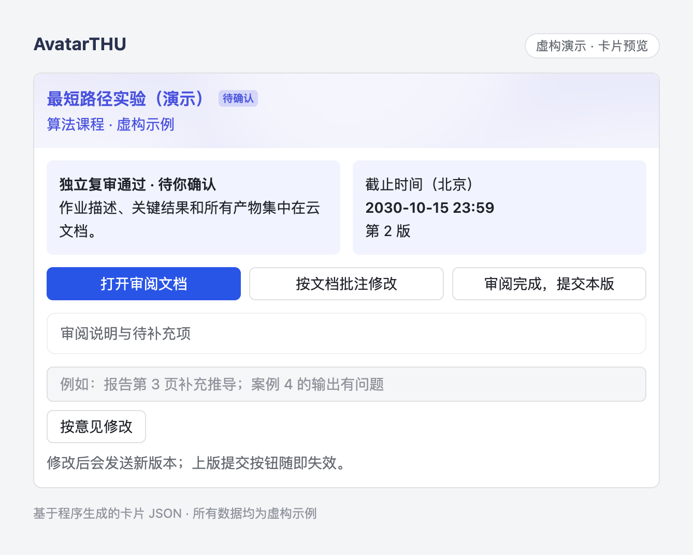
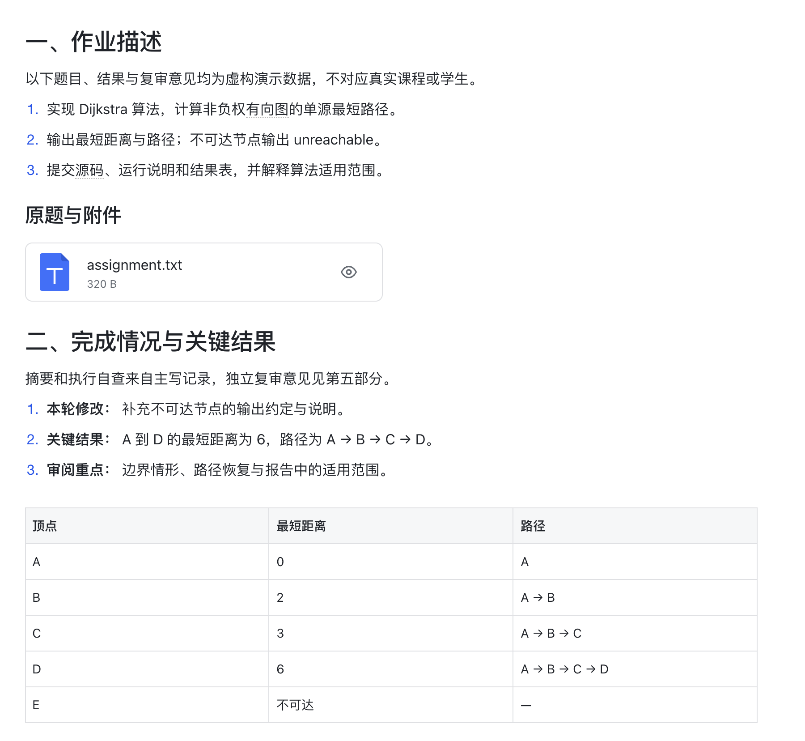
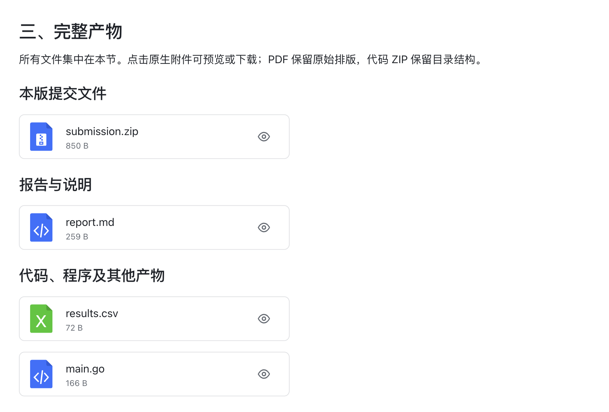
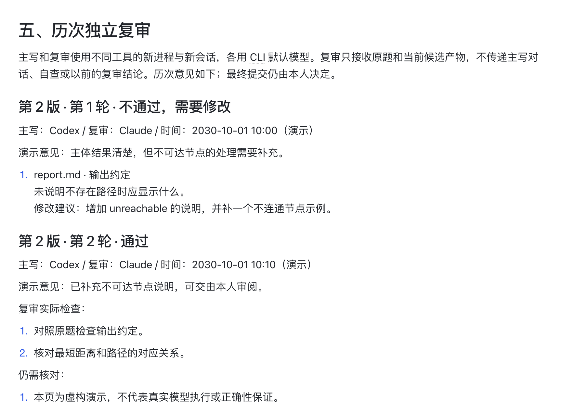

# AvatarTHU

[简体中文](README.md) · **English**

A local assistant that connects Tsinghua Web Learning course materials, assignment work, and your final review.

**Built as a native Go application.** Each platform gets a single executable: no Python, pip, virtual environment, Go, or Java runtime to install. The scheduler stays in the background and starts the writer and reviewer CLIs when work is available. Feishu is optional; downloading materials, preparing assignments, and reviewing them locally also work without it.

[Download a release](https://github.com/Sskift/AvatarTHU/releases) · [Report an issue](https://github.com/Sskift/AvatarTHU/issues) · [Attribution and licenses](THIRD_PARTY.md)

## See it in action

These screenshots use a **fictional assignment and fictional review records**. They are not evidence of a completed assignment or a real model review. The card is a local rendering of the application's generated JSON; the document images capture actual Feishu document content. Only product content is shown: no personal names, avatars, student IDs, accounts, private links, or real course materials. See the [screenshot notes](docs/images/README.md).

The current card, document, and CLI messages are primarily in Chinese; this English README does not imply an English application interface.

### 1. Decide what happens next from the card

Check the revision and review status, open the full document, or leave revision instructions. You decide whether to submit.



### 2. Compare the assignment with the results

The cloud document separates the original requirements, numbered instructions, and result table so you can compare the requested work with the current output.



### 3. Keep deliverables and review history together

Native attachments can be previewed or downloaded. The document ends with each review round's verdict, specific comments, and remaining limitations.

<details>
<summary>Show complete deliverables</summary>



</details>

<details>
<summary>Show independent review history</summary>



</details>

## Install and start

Download the archive for your operating system and architecture from [Releases](https://github.com/Sskift/AvatarTHU/releases), extract it, and initialize once. The archive contains the native executable, documentation, and licenses, without a bundled interpreter.

macOS / Linux:

```sh
chmod +x avatarthu
./avatarthu init
```

Windows PowerShell:

```powershell
.\avatarthu.exe init
```

Initialization installs the executable in your user directory and configures the command entry point. Open a new terminal, then use `avatarthu` directly. If a new Windows terminal has not picked up the updated user PATH, sign out and back in, or use the full path printed by the installer. If macOS blocks the downloaded executable, allow it in **System Settings → Privacy & Security**. The current prerelease is not Apple-notarized or Windows code-signed.

By default, initialization opens the Web Learning login flow and starts the background service. You can also perform the steps separately:

```sh
avatarthu init --no-login --no-start
avatarthu tools
avatarthu login thu
avatarthu doctor
avatarthu service start
```

On macOS, `login thu` first tries the existing Web Learning session in Chrome. Otherwise, it opens a dedicated AvatarTHU browser window for you to complete SSO and any two-factor authentication. Windows supports Chrome and Edge. Selenium, ChromeDriver, and a separate AutoThu executable are not required.

## Required and optional tools

| Feature | External tools |
| --- | --- |
| Scheduling, synchronization, downloads, storage, and local review pages | No additional language runtime |
| Initial Web Learning login or reauthentication | Chrome; Edge is also supported on Windows |
| Writing and independent review | Both Claude Code and Codex CLI, installed and signed in |
| Feishu documents, cards, comments, and callbacks | Optional Lark CLI; reuse an existing installation or install it with npm |
| Compilation, experiments, or report generation for an assignment | Depends on the assignment; unsupported work and verification limits are reported |

Run `avatarthu tools` for installation instructions. `avatarthu doctor` checks both model CLIs for their paths, versions, authentication, and required options. Diagnostics distinguish missing executables, authentication failures, quota limits, network problems, insufficient permissions, incompatible versions, and unavailable default configurations.

If Node.js and npm are already available, you can install both CLIs with:

```sh
npm install -g @anthropic-ai/claude-code @openai/codex
claude
codex
avatarthu doctor
```

Alternatively, use the [Claude Code native installer](https://code.claude.com/docs/en/setup) and [official Codex installation instructions](https://github.com/openai/codex#quickstart). AvatarTHU does not require Node.js; it is only needed if you choose npm to install an external CLI.

## One process, separate schedules

```sh
avatarthu configure --poll-interval 12h
avatarthu service start
avatarthu status
avatarthu keepalive status
```

1. **Web Learning keepalive runs every 10 minutes.** It validates the course API and saves refreshed cookies. An existing SSO session in the application's browser profile may restore access. When reauthentication is necessary, it asks you to run `avatarthu login thu`.
2. **Course polling defaults to every 12 hours.** Configure values such as `30m`, `6h`, `12h`, or `1d`, with a one-minute minimum. Failed synchronization is retried after 15 minutes.
3. **Queued revision requests are checked every minute.** They do not wait for the next course scan. Keepalive continues in the same Go process while an assignment is being worked on.
4. **The computer must be awake.** After wake, overdue work is checked against the current time. macOS uses a LaunchAgent; Windows uses the current user's Task Scheduler for startup and recovery. Windows does not need an administrator service or a stored system password, but the user must remain signed in. Linux uses a systemd user service.

`service start` does not launch duplicate processes. `service stop` stops scheduling, keepalive, and Feishu listeners while keeping all data. Use `avatarthu daemon` to run in the foreground.

## Two independent review modes

```sh
# Claude writes; Codex reviews independently
avatarthu configure --mode claude-codex

# Codex writes; Claude reviews independently
avatarthu configure --mode codex-claude

# Up to 3 review rounds per revision; 0 means unlimited
avatarthu configure --max-review-rounds 3
```

Each stage starts a fresh process, session, and working directory. Each CLI uses its own default model configuration. AvatarTHU does not select, compare, or constrain the configured models.

The reviewer receives the original assignment, course materials, and current candidate files. It does not receive the writer's conversation, self-assessment, previous revision feedback, or earlier review verdicts. Memory, additional rule discovery, and external tool integrations are disabled for that session. The reviewer independently reads the requirements, examines the answer and files, and recalculates or runs checks as needed. This isolates the inputs and sessions; each local CLI still operates within its own permissions and execution environment.

If a review rejects the work, its specific comments go back to the writer for a new attempt and another independent review. Every completed review and its checks are saved durably, including across interruptions. Work that reaches the round limit without approval is left for the owner to handle and is not presented as ready to submit.

Cross-review can catch omissions and mistakes, but it does not guarantee mathematical, experimental, or program correctness. You remain responsible for the final review and submission decision.

## Feishu and review

```sh
avatarthu login lark
avatarthu notifications off
avatarthu notifications on
```

Feishu login reuses a valid local Lark CLI session. If none is configured, it guides you through application setup and authorization. If the CLI is missing, `login lark` can use an existing npm installation to install it into AvatarTHU's tools directory. A different Feishu account cannot take over confirmation rights for existing assignments.

1. Unread announcements are archived and sent to the owner. **A successful delivery receipt is saved before the announcement is marked read.** If marking fails, only that operation is retried, avoiding duplicate messages. Announcements remain unread when Feishu is disabled.
2. For pending assignments, the application downloads the description, attachments, and course materials. Writing and review happen inside that assignment's directory.
3. The conversation receives a review card; all deliverables are embedded in its cloud document. Documents have five sections: **assignment description, progress and key results, complete deliverables, review and actions, and independent review history**. They support numbered lists, formulas, tables, and result images. Native PDF and Office attachments preserve the original report layout for preview.
4. Leave document comments and choose “按文档批注修改” (“Revise from document comments”), write feedback on the card, reply to the current card, or run `avatarthu revise TASK_ID --feedback "Your requested changes"` locally.
5. Only the owner's submission action on the current revision's card can upload the work. The revision, message, nonce, and local file hashes must match. School-side requirements, attachments, and the deadline are checked again. A new revision invalidates the old card.
6. Submission status is persisted before contacting the school API. When a timeout or disconnection leaves the result unknown, **the upload is never retried automatically**. The owner must check Web Learning.

Local-only mode creates an HTML review page with the same sections. Run `avatarthu status` to find its path, and submit manually through the school website. Enabling Feishu later can publish an existing revision as a document and card without redoing the assignment.

## Storage layout

The common entry point is `~/.avatarthu`, or `%USERPROFILE%\.avatarthu` on Windows. On macOS, existing data stays in `~/.local/share/avatarthu`, with a symbolic link at the common entry point. Existing assignments are not copied.

```text
~/.avatarthu/
├── bin/avatarthu                  # Native executable
├── config.json                   # Roles, polling interval, CLI paths
├── session.json                  # Owner's Web Learning session
├── browser-profile/              # Dedicated browser login profile
├── courses/
│   └── semester/course-name--id/
│       ├── course.json
│       ├── notices/              # Original announcements and metadata
│       ├── courseware/           # Incrementally downloaded materials
│       └── homework/assignment-name--id/
│           ├── source/           # Requirements and original attachments
│           ├── runs/r1/round-1/  # Separate writer and reviewer directories
│           ├── outputs/r1/       # Frozen submission and deliverable files
│           ├── reviews/r1/       # Local review, cloud drafts, and receipts
│           └── state.json
├── data/                         # Task index, schedule, delivery receipts
├── logs/                         # Background and execution error logs
└── tools/                        # Optional Lark CLI installation
```

Legacy `outbox/`, `data/reviews/`, and previously sent cards remain compatible; frozen files are not moved. Set `AVATARTHU_HOME` to use an independent data directory. Course data, sessions, accounts, logs, and generated assignments do not belong in Git.

## Common commands

```sh
avatarthu run                     # Scan and process now
avatarthu run --sync-only         # Only sync, download, and deliver announcements
avatarthu run --task TASK_ID      # Sync, then process only the specified assignment
avatarthu keepalive run           # Keep alive now and attempt session recovery
avatarthu status                  # Services, authentication, tasks, and review links
avatarthu service stop            # Stop the background service; preserve data
avatarthu uninstall               # Disable the service; preserve data
```

## Development and distribution

Only developers need Go 1.27.1. Production executables are built with `CGO_ENABLED=0` and do not need additional dynamic libraries or an interpreter.

```sh
go test ./...
go vet ./...
CGO_ENABLED=0 go build -trimpath -o build/avatarthu ./cmd/avatarthu
go run ./cmd/release --os windows --arch amd64 --out dist
```

CI checks core workflows and fresh installation on macOS, Windows, and Linux. Releases include macOS arm64 / amd64, Windows amd64 / arm64, and Linux amd64 / arm64 builds, along with `SHA256SUMS` and third-party licenses.

This is an **Alpha** release for users willing to review their own work and report issues. School-side changes, different course materials, and browser authentication across platforms still need continued validation across accounts. The repository and releases are public; feedback and issues are welcome.

The Web Learning integration and macOS session import were adapted from AutoThu and our login/keepalive contributions, and are built into this project. See [THIRD_PARTY.md](THIRD_PARTY.md) for provenance and licenses.
